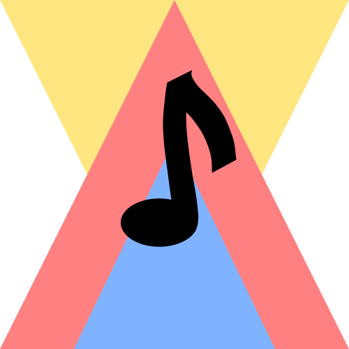

<!--
*** Thanks for checking out the Best-README-Template. If you have a suggestion
*** that would make this better, please fork the repo and create a pull request
*** or simply open an issue with the tag "enhancement".
*** Thanks again! Now go create something AMAZING! :D
***
***
***
*** To avoid retyping too much info. Do a search and replace for the following:
*** acpoppe, A-Cappella, alliepoppe, allisonpoppe89@gmail.com, A Cappella, A music bot for Discord!
-->


<!-- PROJECT SHIELDS -->
<!--
*** I'm using markdown "reference style" links for readability.
*** Reference links are enclosed in brackets [ ] instead of parentheses ( ).
*** See the bottom of this document for the declaration of the reference variables
*** for contributors-url, forks-url, etc. This is an optional, concise syntax you may use.
*** https://www.markdownguide.org/basic-syntax/#reference-style-links
-->
[![Contributors][contributors-shield]][contributors-url]
[![Forks][forks-shield]][forks-url]
[![Stargazers][stars-shield]][stars-url]
[![Issues][issues-shield]][issues-url]
[![MIT License][license-shield]][license-url]
[![LinkedIn][linkedin-shield]][linkedin-url]


<!-- PROJECT LOGO -->
<br />
<p align="center">
  <a href="https://github.com/acpoppe/A-Cappella">
    
  </a>

  <h3 align="center">A Cappella</h3>

  <p align="center">
    A music bot for Discord!
    <br />
    <a href="https://github.com/acpoppe/A-Cappella"><strong>Explore the docs »</strong></a>
    <br />
    <br />
    <a href="https://github.com/acpoppe/A-Cappella">View Demo</a>
    ·
    <a href="https://github.com/acpoppe/A-Cappella/issues">Report Bug</a>
    ·
    <a href="https://github.com/acpoppe/A-Cappella/issues">Request Feature</a>
  </p>
</p>


<!-- TABLE OF CONTENTS -->
<details open="open">
  <summary><h2 style="display: inline-block">Table of Contents</h2></summary>
  <ol>
    <li>
      <a href="#about-the-project">About The Project</a>
      <ul>
        <li><a href="#built-with">Built With</a></li>
      </ul>
    </li>
    <li>
      <a href="#getting-started">Getting Started</a>
      <ul>
        <li><a href="#prerequisites">Prerequisites</a></li>
        <li><a href="#installation">Installation</a></li>
      </ul>
    </li>
    <li><a href="#usage">Usage</a></li>
    <li><a href="#roadmap">Roadmap</a></li>
    <li><a href="#contributing">Contributing</a></li>
    <li><a href="#license">License</a></li>
    <li><a href="#contact">Contact</a></li>
    <li><a href="#acknowledgements">Acknowledgements</a></li>
  </ol>
</details>


<!-- ABOUT THE PROJECT -->
## About The Project

[](https://allisonpoppe.com)

A music bot for Discord!


### Built With

* [Discord.js](https://github.com/discordjs/discord.js/)
* [ytdl-core](https://github.com/fent/node-ytdl-core)
* [ytsr](https://github.com/TimeForANinja/node-ytsr)


<!-- GETTING STARTED -->
## Getting Started

To get a local copy up and running follow these simple steps.

### Prerequisites

This is an example of how to list things you need to use the software and how to install them.
* npm
  ```sh
  npm install npm@latest -g
  ```

### Installation

1. Clone the repo
   ```sh
   git clone https://github.com/acpoppe/A-Cappella.git
   ```
2. Install NPM packages
   ```sh
   npm install
   ```
3. Navigate to the app directory
   ```sh
   cd /PATH_TO_DIRECTORY/acappella
   ```
4. Rename configTemplate.json to config.json
   ```sh
   mv configTemplate.json config.json
   ```
5. Put your own bot information from the Discord developer's portal in config.json where there are placeholders
   [Find more information here](https://discord.com/developers/docs/intro)
6. Run the app
   ```sh
   node acappella.js
   ```


<!-- USAGE EXAMPLES -->
## Usage

<!-- Use this space to show useful examples of how a project can be used. Additional screenshots, code examples and demos work well in this space. You may also link to more resources. -->

_For more examples, please refer to the [Documentation](https://allisonpoppe.com)_ (Documentation to come in the future)


<!-- ROADMAP -->
## Roadmap

See the [open issues](https://github.com/acpoppe/A-Cappella/issues) for a list of proposed features (and known issues).


<!-- CONTRIBUTING -->
## Contributing

Contributions are what make the open source community such an amazing place to learn, inspire, and create. Any contributions you make are **greatly appreciated**.

1. Fork the Project
2. Create your Feature Branch (`git checkout -b feature/AmazingFeature`)
3. Commit your Changes (`git commit -m 'Add some AmazingFeature'`)
4. Push to the Branch (`git push origin feature/AmazingFeature`)
5. Open a Pull Request


<!-- LICENSE -->
## License

This application is currently UNLICENSED.


<!-- CONTACT -->
## Contact

Allison Poppe - [@alliepoppe](https://twitter.com/alliepoppe) - allisonpoppe89@gmail.com

Project Link: [https://github.com/acpoppe/A-Cappella](https://github.com/acpoppe/A-Cappella)


<!-- ACKNOWLEDGEMENTS -->
## Acknowledgements

* [Yvonne Rieck](https://github.com/kywision)


<!-- MARKDOWN LINKS & IMAGES -->
<!-- https://www.markdownguide.org/basic-syntax/#reference-style-links -->
[contributors-shield]: https://img.shields.io/github/contributors/acpoppe/A-Cappella.svg?style=for-the-badge
[contributors-url]: https://github.com/acpoppe/A-Cappella/graphs/contributors
[forks-shield]: https://img.shields.io/github/forks/acpoppe/A-Cappella.svg?style=for-the-badge
[forks-url]: https://github.com/acpoppe/A-Cappella/network/members
[stars-shield]: https://img.shields.io/github/stars/acpoppe/A-Cappella.svg?style=for-the-badge
[stars-url]: https://github.com/acpoppe/A-Cappella/stargazers
[issues-shield]: https://img.shields.io/github/issues/acpoppe/A-Cappella.svg?style=for-the-badge
[issues-url]: https://github.com/acpoppe/A-Cappella/issues
[license-shield]: https://img.shields.io/github/license/acpoppe/A-Cappella.svg?style=for-the-badge
[license-url]: https://github.com/acpoppe/A-Cappella/blob/master/LICENSE.txt
[linkedin-shield]: https://img.shields.io/badge/-LinkedIn-black.svg?style=for-the-badge&logo=linkedin&colorB=555
[linkedin-url]: https://linkedin.com/in/allison-poppe-2426a7193